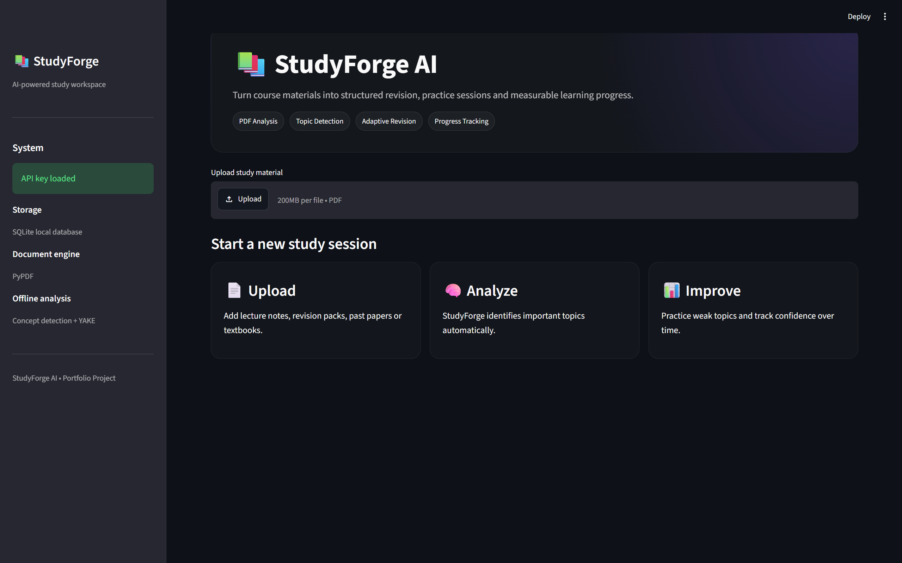
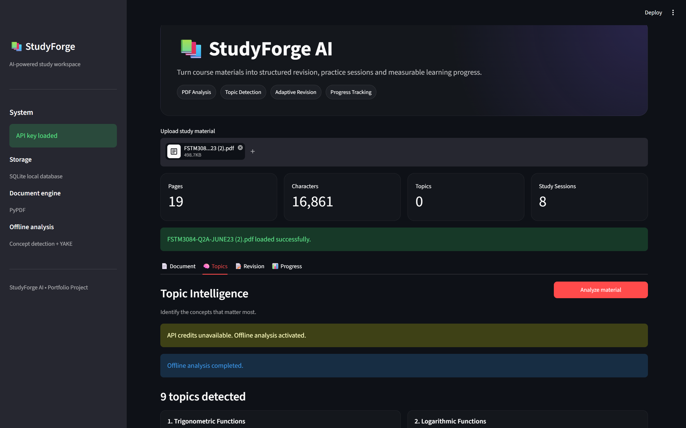
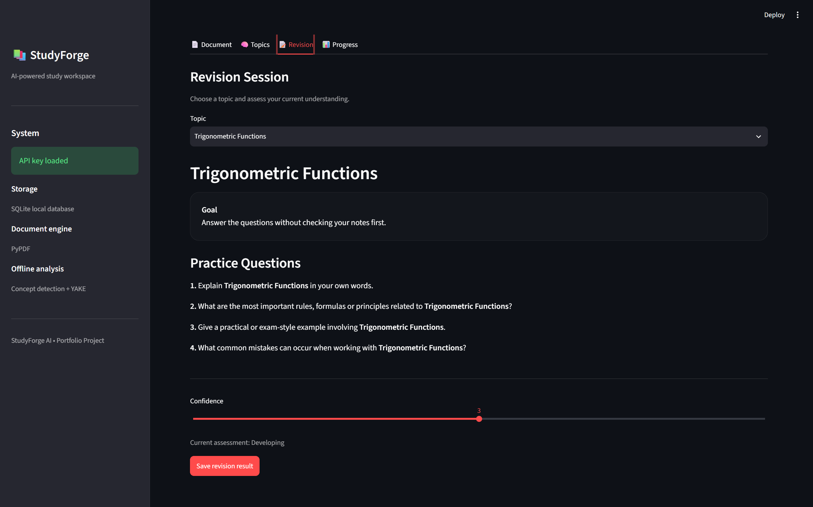
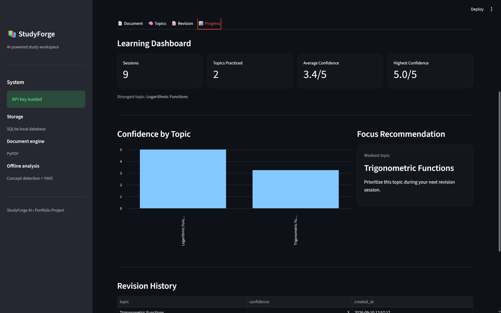

# 📚 StudyForge AI

**StudyForge AI** is a study assistant that transforms PDF course materials into structured revision sessions and helps students track their learning progress.

Upload lecture notes, revision packs, textbooks, or past papers. StudyForge extracts the document content, identifies important academic topics, creates revision sessions, and tracks confidence across different concepts.

🌐 **Live Demo:** [studyforge-ai.streamlit.app](https://studyforge-ai.streamlit.app/)

---

## ✨ Features

- 📄 Upload and process PDF study materials
- 🔎 Extract text automatically from PDFs
- 🧠 Detect important academic topics
- 🤖 Optional OpenAI-powered topic analysis
- 📴 Automatic offline fallback when the AI service is unavailable
- ✏️ Review and manually edit detected topics
- 📝 Create structured revision sessions
- 🎯 Practice individual topics
- 📊 Record confidence scores from 1–5
- 💾 Store learning progress using SQLite
- 📈 Visualize confidence by topic
- 🔍 Identify strongest and weakest topics
- 🎯 Recommend topics that need more revision
- 🌐 Public Streamlit deployment

---

## 🖥️ Preview

### Home

The StudyForge workspace provides a simple workflow for uploading and analyzing study material.



### Topic Intelligence

StudyForge analyzes uploaded material and identifies academic concepts that may be important for revision.

Detected topics can also be reviewed and edited manually.



### Revision Session

Students can select a detected topic, work through structured revision questions, and record their current confidence level.



### Learning Dashboard

Revision results are stored and displayed through a progress dashboard with confidence statistics and weak-topic recommendations.



---

## 🛠️ Tech Stack

### Core

- **Python**
- **Streamlit**

### Document Processing

- **PyPDF**

### AI

- **OpenAI API**
- **YAKE keyword extraction**
- Custom academic concept detection

### Data

- **SQLite**
- **Pandas**

### Development

- **Git**
- **GitHub**
- **python-dotenv**

---

## 🧠 How StudyForge Works

```text
                 ┌─────────────────────┐
                 │     Upload PDF      │
                 └──────────┬──────────┘
                            ↓
                 ┌─────────────────────┐
                 │   Extract PDF Text  │
                 └──────────┬──────────┘
                            ↓
                 ┌─────────────────────┐
                 │    Topic Analysis   │
                 └──────────┬──────────┘
                            ↓
               ┌─────────────────────────┐
               │ Is the OpenAI API       │
               │ currently available?    │
               └───────────┬─────────────┘
                           │
                  ┌────────┴────────┐
                  ↓                 ↓
            AI Analysis       Offline Analysis
                  │                 │
                  └────────┬────────┘
                           ↓
                 ┌─────────────────────┐
                 │   Detected Topics   │
                 └──────────┬──────────┘
                            ↓
                 ┌─────────────────────┐
                 │  Revision Session   │
                 └──────────┬──────────┘
                            ↓
                 ┌─────────────────────┐
                 │  Confidence Score   │
                 └──────────┬──────────┘
                            ↓
                 ┌─────────────────────┐
                 │    SQLite Storage   │
                 └──────────┬──────────┘
                            ↓
                 ┌─────────────────────┐
                 │ Progress Dashboard  │
                 └─────────────────────┘
```

---

## 🤖 AI + Offline Fallback

StudyForge is designed so that the core application remains usable even if an external AI service is unavailable.

When an OpenAI API key is configured, StudyForge first attempts to analyze the study material using an AI model.

If the API cannot be used, the application automatically switches to its offline analysis system.

The offline detector combines:

- predefined academic concept recognition
- weighted keyword matching
- YAKE keyword extraction
- filtering of exam instructions and administrative text

This allows StudyForge to continue identifying useful study topics without depending entirely on an external service.

---

## 📝 Revision Workflow

After analyzing a document, the student can select one of the detected topics.

StudyForge creates a structured revision session containing questions such as:

```text
1. Explain the topic in your own words.

2. What are the most important rules,
   formulas or principles related to it?

3. Give a practical or exam-style example.

4. What common mistakes can occur
   when working with this topic?
```

The student then records a confidence score:

```text
1 = Very weak
2 = Weak
3 = Developing
4 = Confident
5 = Very confident
```

The result is stored in the learning history.

---

## 📊 Progress Tracking

StudyForge tracks revision sessions using a local SQLite database.

The dashboard currently displays:

- total revision sessions
- number of topics practiced
- average confidence
- highest confidence score
- strongest topic
- weakest topic
- confidence by topic
- complete revision history
- recommended focus area

---

## 📂 Project Structure

```text
studyforge-ai/
│
├── assets/
│   ├── dashboard.png
│   ├── topics.png
│   ├── revision.png
│   └── progress.png
│
├── app.py
├── README.md
├── requirements.txt
├── .gitignore
│
├── .env
├── .venv/
└── studyforge.db
```

The following files are local and should not be committed:

```text
.env
.venv/
studyforge.db
__pycache__/
```

---

## 🚀 Getting Started

### 1. Clone the repository

```bash
git clone https://github.com/adalyatixten/studyforge-ai.git
```

### 2. Open the project directory

```bash
cd studyforge-ai
```

### 3. Create a virtual environment

```bash
python -m venv .venv
```

On Windows you can also use:

```bash
py -m venv .venv
```

### 4. Activate the environment

#### Windows PowerShell

```powershell
.\.venv\Scripts\Activate.ps1
```

#### macOS / Linux

```bash
source .venv/bin/activate
```

### 5. Install dependencies

```bash
pip install -r requirements.txt
```

### 6. Run StudyForge

```bash
streamlit run app.py
```

The application should open at:

```text
http://localhost:8501
```

---

## 🔑 Optional OpenAI Configuration

StudyForge can use the OpenAI API for more intelligent topic analysis.

Create a `.env` file in the project directory:

```text
OPENAI_API_KEY=your_api_key_here
```

Do **not** commit `.env` to GitHub.

The project is designed to automatically use offline topic detection when AI analysis is unavailable.

---

## 🌐 Live Demo

StudyForge is deployed using Streamlit Community Cloud.

### 🚀 Try it here

**https://studyforge-ai.streamlit.app/**

The public demo can operate using the offline analysis workflow when no OpenAI API access is configured.

---

## ⚠️ Current Limitations

StudyForge is still under active development.

Current limitations include:

- offline topic detection is less accurate than full AI analysis
- revision questions are currently template-based
- confidence is self-assessed by the student
- PDF extraction works best with text-based PDFs
- scanned documents may require OCR support
- SQLite progress storage is local and is not yet designed as persistent multi-user cloud storage
- user accounts are not implemented yet

---

## 🗺️ Roadmap

### AI Revision

- [ ] AI-generated exam-style questions
- [ ] Student answer input
- [ ] Automatic AI grading
- [ ] Detailed answer feedback
- [ ] Score-based weak-topic detection
- [ ] Adaptive question difficulty
- [ ] Personalized revision plans

### Document Intelligence

- [ ] Multiple PDF support
- [ ] Document library
- [ ] Semantic search
- [ ] Embeddings
- [ ] RAG-based question answering
- [ ] Source citations
- [ ] OCR support for scanned documents

### Learning Analytics

- [ ] Topic mastery scores
- [ ] Progress over time
- [ ] Study streaks
- [ ] Quiz performance analytics
- [ ] Recommended next study session
- [ ] Revision scheduling

### Platform

- [ ] User authentication
- [ ] Individual user profiles
- [ ] Cloud database
- [ ] Persistent progress across devices
- [ ] Mobile-friendly interface

---

## 🎯 Project Goal

StudyForge AI explores how artificial intelligence can be used to create more adaptive educational software.

The long-term goal is to build a system that goes beyond simply summarizing documents.

StudyForge should eventually be able to:

```text
Understand what the student is studying
                ↓
Identify important concepts
                ↓
Test the student's understanding
                ↓
Evaluate their answers
                ↓
Detect weak areas
                ↓
Adapt future revision sessions
                ↓
Track improvement over time
```

---

## 💡 Why I Built This

Many study tools focus on storing notes or summarizing documents.

I wanted to explore a different idea: a study system that can use course material to guide revision and gradually adapt to what the student understands well and what still needs work.

StudyForge is also an ongoing project for exploring:

- AI application development
- document processing
- educational technology
- data persistence
- fallback system design
- learning analytics
- product-oriented software development

---

## 👤 Author

**Adalyat Orduhani**

GitHub: [@adalyatixten](https://github.com/adalyatixten)

---

## 📌 Status

**Current version:** Early development / prototype

The core workflow is functional:

```text
PDF → Topics → Revision → Progress
```

Development is continuing with AI-generated assessment and adaptive learning features planned next.